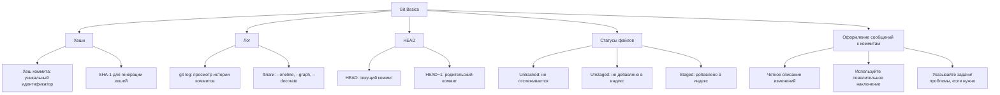

# Инструкция по работе с Git

## Основные команды

#### git init

#### git add <file>

#### git commit -m "Message"

#### git status

#### git log

#### git branch <branch-name>

#### git checkout <branch-name>

#### git merge <branch-name>

#### git push origin <branch-name>

#### git pull origin <branch-name>

#### HEAD -- это голова.
#### Коммит -- это всему голова.

<и тут пустая строка!>

